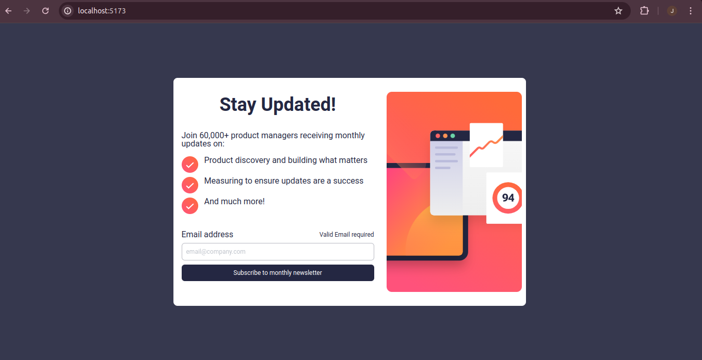
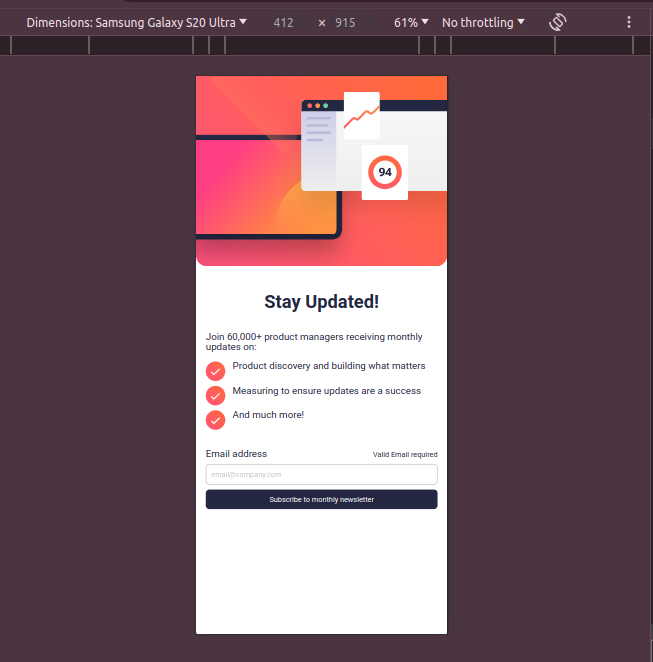

# Frontend Mentor - Newsletter sign-up form with success message solution

This is a solution to the [Newsletter sign-up form with success message challenge on Frontend Mentor](https://www.frontendmentor.io/challenges/newsletter-signup-form-with-success-message-3FC1AZbNrv). Frontend Mentor challenges help you improve your coding skills by building realistic projects.

## Table of contents

- [Overview](#overview)
  - [The challenge](#the-challenge)
  - [Screenshot](#screenshot)
  - [Links](#links)
- [My process](#my-process)
  - [Built with](#built-with)
  - [Continued development](#continued-development)
- [Author](#author)

## Overview

### The challenge

Users should be able to:

- Add their email and submit the form
- See a success message with their email after successfully submitting the form
- See form validation messages if:
  - The field is left empty
  - The email address is not formatted correctly
- View the optimal layout for the interface depending on their device's screen size
- See hover and focus states for all interactive elements on the page

### Screenshot

### Links

- GitHUB: [https://github.com/njeruthuo/newsletter-signup-with-success-2](https://github.com/njeruthuo/newsletter-signup-with-success-2)
- Vercel: [https://newsletter-signup-with-success-2.vercel.app/](https://newsletter-signup-with-success-2.vercel.app/)

## My process

### Built with

- TailwindCSS
- HTML5
- JavaScript
- CSS3
- Flexbox
- Mobile-first workflow
- [React](https://reactjs.org/) - JS library

### Continued development

I would like to ask for help in developing a part of this solution. The email state is not updating in time, that is, it is one step back. Once I submit the form, the email state is not updated immediately and hence not available in the re-render. If you can help me with this, please reach out.
Thanks in advance.

## Author

<!-- - Website - [Add your name here](https://www.your-site.com) -->

- Frontend Mentor - [@njeruthuo](https://www.frontendmentor.io/profile/njeruthuo/)
- Twitter - [@njeruthuo](https://www.twitter.com/njeruthuo)
